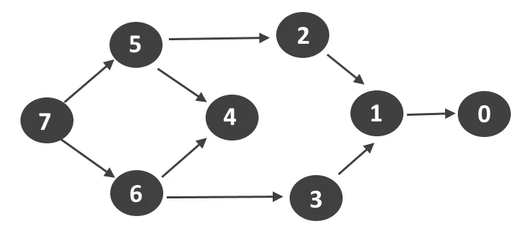
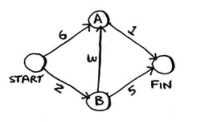

# Algorithms & Data Structures

This are my notes from my quest to understand algorithms and data structures. It serves as a guide and resource to the core concepts of algorithms, when to use them, and some of the most commonly used.

---

## How to Run

Clone this repo. Follow this readme along with each code example in its name file. To run the code in the command line, from the [Algorithms](algorithms) directy type in the command line:

```
python python/file_name.py
```

---

## Concepts

Here a few key concepts you will see coming up in the following algorithm examples:

### Logarithms

Logs are the flip of exponentials:

- 10<sup>2</sup> = 100 => log<sub>10</sub> 100 = 2
- 10<sup>3</sup> = 1000 => log<sub>10</sub> 1000 = 3
- 10<sup>4</sup> = 10000 => log<sub>10</sub> 10000 = 4

### Recursion

Recursion is where a function calls itself inside it's function. Every recursive function has 2 parts, the `Base Case` and the `Recursive Case`. The recursive case is when the function calls itself, the base case is when ths function does not call itself again. This is important as to not cause an infinite loop. Recursion uses the `call stack` to save the variables for multiple functions in memory, it only does one of two things - adds a function call or removes a function call from the stack. A recursive call with the same variable cannot access another variable in the call stack. Using the stack is convenient, however it can use lots of memory as your computer is saving information for many function calls.

### Divide and Conquer

An algorithm design based on multi-branched recursion. It works by recursivly breaking down a problem into two or more sub problems of the same type. You would figure out a simple case to be the base case of the algorithm, and then figure out how to reduce your problem and get to the base case.

### Big O Notation

Big O gives a worst case scenario run time. of an algorithm, it tells us how fast an algorithm is, and how the running time is affected if the list size is changed. Big O doesn’t tell you the speed in seconds. Big O notation lets you compare the number of operations, it tells you how fast the algorithm grows.

`O(n)`
O = 'Big O'
n = Number of operations

**Example:**

- O(log n) _Example:_ Binary search.
- O(n) _Example:_ Simple search.
- O(n \* log n) _Example:_ Quicksort.
- O(n<sup>2</sup>) _Example:_ Selection sort.
- O(n!) _Example:_ A really slow algorithm.


---

## Hash Tables

- Has tables are a very fast and efficient data structure for storing, reading and inserting data. A hash table uses a `Hash Function` to compute a string into an index of an array, where the value will be stored in. The hash function will map a string to the same index every time, therefore it is very quick to read the value of what you are asking for.

- A hash table has keys and values. The keys are the strings and the value is stored associated to that key. A hash table maps keys to values, therefore it is important for hash functions to consistently return the same output for the same input.

- See the [Hash Table](python/hash_table.py) file for an example of creating and using a hash table, written in Python.

- Hash tables are used for reading the values on a huge scale as they are instant in retrieving the information. You can also use the `.get` function in python to get the value of a key if it exists in the hash table, if not it will return the `None` value. The `guest_list` example in the [Hash Table](python/hash_table.py) file shows how fast it is to check if an entry exists in a hash table (duplicates), rathe rthan searching through the entire list first.

- Has tables are used in web pages through `Caching`. Caching is when a website remembers stores information and pages you have visited to help with perfomance. When you visit a page, it first checks weather or not the webpage is stored in a hash. If it does, it retrieves the data from the hash. If not the server boots up and serves the page. This can all happen very quickly and helps use the server ONLY if the data does not already exist in the hash table.

- Hash tables have an average Big O of **_O(1)_** for everything (reading, inserting and deleting), meaning _constant time_. This means time taken the same, regardless of how many entries it has (just like retrieving elements from an array). Hash tables have a worst case Big O of **_O(n)_** - to avoid this, it is important to avoid `Collisions`.

- **Collisions** Collisions are when a hash function assigns the same slot for 2 keys. The second key will overwrite the value of the first key. You can add a linked list to this slot of the hash, but the longet that linked list gets, the slower the overall hash tables operations will be. Therefore it is extremly important to have as few collisions as possible.

- To avoid collisions, it needs a good `Load Factor` and a good `Hash Function`.

- The load factor is number of items in a hash table / the total number of slots. Therefore you want yout load factor to be < 1, otherwise you will want to `Resize` and increase the capacity of the array that is used for storage in the hash table. A good rule of thumb is to resize once the hash table has a load factor of < 0.7.

- A good hash function is one that distributes values evenly in an array, rather than in consecutive slots.

---

## Sort

### Selection Sort

- This algorithm goes through a list, searches for the smallest/largest element, and adds that element to a new list. It then repeats to find the next element in order. It keeps doing this until we end up with an ordered list.

- Each element in the initial list has to be searched through, this takes **_O(n)_**. You then have to repeat this **_n x n_** times as you keep going through the original list. This therefore has a Big O notation of **_O(n<sup>2</sup>)_**.

- See the [Selection Sort](python/selection_sort.py) file for a working example of the Selection Sort algorithm, written in Python.

### Quicksort

- Quicksort uses the _Divide and Conquer_ strategy, and is commonly used as the in built sort function in many programmin languages. Quicksort involves selecting a `pivot` from a given list. The pivot is used to compare every other element in the array (> or < than the pivot). This process is called `Partitioning`. Then _recursion_ is used to continue the same process on the two sub arrays that were created (> and < the pivot) until the list is sorted. The sorted list will be the product of the < array Quicksort + pivot + > array Quicksort.

- Quicksort has an average Big O notation of **_O(n log n)_** (it has a worst case Big O of **_O(n<sup>2</sup>)_**). Quicksort however has a smaller constant time that pther comparable **_O(n log n)_** sorting algorithms (such as _Merge Sort_) therefore it hits it's average case far more than it's worst case. The performance of Quicksort depends heavily on the pivot used.

- See the [Quicksort](python/quicksort.py) file for a working example of the Binary Search algorithm, written in Python.

---

## Search

### Binary Search

- Its input is a sorted list of elements. If an element you’re looking for is in that list, binary search returns the position where it’s located. Otherwise, binary search returns null. Binary search first accesses the middle element of the sorted list and therefore elimintes half of the numbers straight away. This is then repeated, it searches for the midde number and then eliminates half of the remaining numbers every time.

- Binary search takes **_log<sub>2</sub> n_**.

- If you were 'Simple Searching' (Starting at the first element and searching the next one until the desired element is found or the end is reached) every element of a list of 8 numbers, therefore it's logarithm would be log n in the worst case. For Binary Search, the worst case you would have to check for would be **_log n_**. For a list of 8 elements **_log 8 == 3_** because 2<sup>3</sup> == 8. Therefor for a list of 8 numbers, 3 numbers would have to be checked at most.

- Binary Search runs in Logarithmic time (**_O(log n)_**), as opposed to Simple Searching running in Linear Time (**_O(n)_**).

- See the [Binary Search](python/binary_search.py) file for a working example of the Binary Search algorithm, written in Python.

### Breadth-First Search (BFS)

- BFS allows you to find the shortest distance between two things. BFS is used to solve `Shortest Path` problems, this could be shortest route on public transport, it also could be the shrtest number of moves to win in a game of chess.

- In order to solve shortest path problems, the problem itself is modeled as a `Graph`. Graphs contain `Nodes` that are connected together by `Edges`.


- Directly connected nodes (via edges) are referred to as `Neighbours`. BFS is different to binary search as it runs on graphs and answers: 1) Is there a path from node A - B? and 2) What is the shortest path between node A and B.

- BFS first searches 'first degree' neighbours as this is more efficient, then it searches 'second degree' neighbours and so on. It will create lists to search, first the nearest neighbours (perhaps connected by one edge), and then a second list of all nodes that are neighbours to the starting nodes neighbours.

- Nodes are searched in the order they are added, therefore the data structure is called a `Queue`. A queue is known as a `FIFO` data structure (First In First Out) The first node added is frnt of the queue to be searched and so on. A queue can either `Enqueue` (add an item to the queue aka `Push`) or `Dequeue` (take an item off the queue aka `Pop`).

- See the [Breadth First Search](python/breadth_first_search.py) file for examples of implementing graphs in Python using hash tables.

- Graphs can be `Directed` or `Undirected`. A directed graph is where edges run from one node to another node in only 1 direction (with an arrow for the direction). So the node A pointing to a node B will have B as its neighbour, but Node B wil have no neighbours. An undirected graph will have a line edge between two nodes, and they will both be neighbours of eachother. If all edges in a graph point away from the original node then this is known as a `Tree`.

- You can also make an ordered list out of a graph. If a trees node A depends on node B, then node A shows up later in the list. This is called `Topological Sort`, and it’s a way to make an ordered list out of a graph.



- See the [Breadth First Search](python/breadth_first_search.py) file for a working example of the BFS algorithm, written in Python.

- BFS has a Big O of **_O(V+E)_** (V for number of `Vertices` (Nodes)) and E for Edges)

### Dijkstras

- Where BFS found the path with the fewest 'stops' between nodes, but it does not necessarily mean it the fastest path - this is what `Dijkstra’s` algorithm works out for us. It works out based on the given time of each edge, what the shortest time to the end node is (regardless of how many nodes are passed).

- In Dijkstra's algorithm, a `Weight` (number) is assigned to each edge, the algorithm therefore finds the path with the smallest total weight. For `Unweighted` graphs it is common practise to use BFS, for `Weighted` graphs Dijkstras is the algorithm of choice.

- Graphs can also have `Cycles`, this means you can start at a node, travel around, and end up at the same node (like a loop).

- Dijkstra’s algorithm only works with `Directed Acyclic Graphs` (DAGs).

- Dijkstra’s algorithm has four steps:

1. Find the cheapest node, this is the node you can get to in the least amount of time (smallest weight).
2. Check whether there’s a cheaper path to the neighbors of this node. If so, update their costs.
3. Repeat until you’ve done this for every node in the graph.
4. Calculate the final path.

- A `Negative Weight Edge` is when the weight of an edge is negative, i.e it would take 'time' off the travel to that node in the graph. negative-weight edges do not work with Dijkstra’s algorithm. If you want to find the shortest path in a graph that has negative-weight edges, you would have to use the `Bellman-Ford` algorithm.

- See the [Dijkstra](python/dijkstra.py) file for a working example of the dijkstra algorithm, written in Python using the following graph as an example (3 hash tables are created, one for the `Graph`, one for the `Cost` and one for the `Parents`):



---

## Greedy Algorithms

---

## Acknowledgements

[Grokking Algorithms](https://www.amazon.co.uk/Grokking-Algorithms-illustrated-programmers-curious/dp/1617292230/ref=sr_1_1?crid=GUFJQ16X6SJ0&dchild=1&keywords=grokking+algorithms&qid=1591798578&s=books&sprefix=grokk%2Cstripbooks%2C174&sr=1-1) was my primary resource in my studies, it is written by [Aditya Bhargava](https://github.com/egonSchiele).
