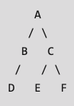

# Algorithms & Data Structures

This are my notes from my quest to understand algorithms and data structures. It serves as a guide and resource to the core concepts of algorithms, when to use them, and some of the most commonly used. Examples of the algorithms are included in `Python` and `JavaScript`.

For benchmarking and a visual display of the time it takes to run the algorithms we will talk about below, visit [Algorithmic Complexity](https://github.com/davidpaps/algorithmic_complexity).

---

## How to Run

Clone this repo. Follow this readme along with each code example in its name file. To run the code in the command line, from the [Algorithms](algorithms) directy type in the command line for Python files:

```
python python/file_name.py
```

And for JavaScript files make sure you have **Node** installed on your machine and in the command line type:

```
node javascript/fileName.js
```

I have also included some example questions from [Leet Code](https://leetcode.com/) and [Hacker Rank](https://www.hackerrank.com/) that I felt are good for testing your knowledge. These are in the [Questions](questions) directory. To run my examples, navigate to the questions directory and in the command line type in:

```
node file_name.js
```

---

## Concepts

Here a few key concepts you will see coming up in the following algorithm examples:

### Logarithms

Logs are the flip of exponentials:

- 10<sup>2</sup> = 100 => log<sub>10</sub> 100 = 2
- 10<sup>3</sup> = 1000 => log<sub>10</sub> 1000 = 3
- 10<sup>4</sup> = 10000 => log<sub>10</sub> 10000 = 4

---

### Recursion

- Recursion is where a function calls itself inside it's function. Every recursive function has 2 parts, the `Base Case` and the `Recursive Case`. The recursive case is when the function calls itself, the base case is when ths function does not call itself again, this is important as to not cause an infinite loop.

- Recursion uses the `call stack` to save the variables for multiple functions in memory, it only does one of two things - adds a function call or removes a function call from the stack. A recursive call with the same variable cannot access another variable in the call stack. Using the stack is convenient, however it can use lots of memory as your computer is saving information for many function calls.

---

### Divide and Conquer

An algorithm design based on multi-branched recursion. It works by recursivly breaking down a problem into two or more sub problems of the same type. You would figure out a simple case to be the base case of the algorithm, and then figure out how to reduce your problem and get to the base case.

---

### Big O Notation

- Big O gives a worst case scenario run time. of an algorithm, it tells us how fast an algorithm is, and how the running time is affected if the list size is changed. Big O doesn’t tell you the speed in seconds. Big O notation lets you compare the number of operations, it tells you how fast the algorithm grows.

`O(n)`
O = 'Big O'
n = Number of operations

- O(1) = **Constant Time**
- O(log n) = **Logarithmic Time** _Example:_ Binary search.
- O(n) = **Linear Time** _Example:_ Simple search.
- O(n \* log n) = **Linearithmic Time** _Example:_ Quicksort.
- O(n<sup>2</sup>) = **Quadratic Time** _Example:_ Selection sort.
- O(n!) = **Factorial Time** _Example:_ A really slow algorithm.


---

## Data Structures

---

### Arrays

- Arrays store elements in memory, and these elements are allocated consecutive in 'blocks' of memory. If you want to add an element to an array that has already been created, the computer will have to find space in memory that will house all the elements consecutivly (regardless of where the new element is added).

- Therefore if you are out of memory, the computer has to do lots of work to allocate all the data to a new place in memory. You can assign more space that you need to avoid this happening, but then that memory is wasted and cannot be used elsewhere.

- Arrays advatage is that they are very quick at reading the elements in the 'blocks'. If we know an array has 5 blocks, (and we know the index starts at 0) we can nstantly access any element by referencing its index number (array[0]).

- When deleting an element from an array, every element in the array needs to be moved up by 1 index, thus it is a costly execution.

- For reading an element in an Array, the Big O is **_O(1)_**, for inserting an element into an array the Big O is **_O(n)_**, for deleting an element in an array, the Big O is **_O(n)_**.

- Arrays are generally used more as they allow `Random Access` (access to elements instantly anywhere in the array).

---

### Linked Lists

- Linked lists behave like an array in many ways, however elements in a list do not need to be stored consecutivly, they can be allocated all over the computers memory. Each item will store the address of the next item in the list - the random memory addresses are linked together.

- Adding an item to a link list is very easy, as the element can be stored anywhere in memory, the previous element will therefore point to this new elements memory address (regardless of where the new element is added).

- Linked lists are however slow at reading elements. If a link list contains 10 elements, you cannot simply start searching at index number 9. You have to begin at the start, as each one refers to the next elements memory address.

- Deleting an element in a linked list is also quick, it just needs to change the previous element to point to a different place in memory.

- For reading an element in a linked list, the Big O is **_O(n)_**, for inserting an element into a linked list the Big O is **_O(1)_**, for deleting an element in a linked list, the Big O is **_O(1)_**.

- Linked lists are not used as often as they only allow `Sequential Access` (you have to start at the first element into the list and proceed one by one to then reach the desired element).

---

### Sets

- Sets are a datastructre like a list, except they can not have duplicates. An array can be passed in to a set, and the return will be a set containing all unique elements.

- Sets have some interesting properties:

- A set `Union` can be created, which combines two or more sets.
- A set `Intersection` can be created, which finds the items that appear in 2 or more sets.
- a set `Difference` can be created, which subtracts the items in one set, from an item in another if they are equal.

- See these files for examples of sets, written in [Python](python/greedy_algorithms.py) and [JavaScript](javascript/greedyAlgorithms.js).

---

### Hash Tables

- Has tables are a very fast and efficient data structure for storing, reading and inserting data. A hash table uses a `Hash Function` to compute a string into an index of an array, where the value will be stored in. The hash function will map a string to the same index every time, therefore it is very quick to read the value of what you are asking for.

- A hash table has keys and values. The keys are the strings and the value is stored associated to that key. A hash table maps keys to values, therefore it is important for hash functions to consistently return the same output for the same input.

- See the [Hash Table](python/hash_table.py) file for an example of creating and using a hash table, written in Python. - See the [Hash Table](javascript/hashTable.js) file for an example of creating and using a hash table, written in JavaScript.

- Hash tables are used for reading the values on a huge scale as they are instant in retrieving the information. You can also use the `.get` function in python to get the value of a key if it exists in the hash table, if not it will return the `None` value. The `guest_list` example in the [Hash Table](python/hash_table.py) file shows how fast it is to check if an entry exists in a hash table (duplicates), rathe rthan searching through the entire list first.

- Has tables are used in web pages through `Caching`. Caching is when a website remembers stores information and pages you have visited to help with perfomance. When you visit a page, it first checks weather or not the webpage is stored in a hash. If it does, it retrieves the data from the hash. If not the server boots up and serves the page. This can all happen very quickly and helps use the server ONLY if the data does not already exist in the hash table.

- Hash tables have an average Big O of **_O(1)_** for everything (reading, inserting and deleting), meaning _constant time_. This means time taken the same, regardless of how many entries it has (just like retrieving elements from an array). Hash tables have a worst case Big O of **_O(n)_** - to avoid this, it is important to avoid `Collisions`.

- **Collisions** Collisions are when a hash function assigns the same slot for 2 keys. The second key will overwrite the value of the first key. You can add a linked list to this slot of the hash, but the longet that linked list gets, the slower the overall hash tables operations will be. Therefore it is extremly important to have as few collisions as possible.

- To avoid collisions, it needs a good `Load Factor` and a good `Hash Function`.

- The load factor is number of items in a hash table / the total number of slots. Therefore you want yout load factor to be < 1, otherwise you will want to `Resize` and increase the capacity of the array that is used for storage in the hash table. A good rule of thumb is to resize once the hash table has a load factor of < 0.7.

- A good hash function is one that distributes values evenly in an array, rather than in consecutive slots.

- See these files for examples of hash tables, written in [Python](python/breadth_first_search.py) and [JavaScript](javascript/breadthFirstSearch.js).

---

You will see other Data Structures described later on in the algorithm descriptions. These include `Graphs`, `Trees`, `Stacks` and `Queues`.

---

## Algortihms

### Sort

#### Selection Sort

- This algorithm goes through a list, searches for the smallest/largest element, and adds that element to a new list. It then repeats to find the next element in order. It keeps doing this until we end up with an ordered list.

- Each element in the initial list has to be searched through, this takes **_O(n)_**. You then have to repeat this **_n x n_** times as you keep going through the original list. This therefore has a Big O notation of **_O(n<sup>2</sup>)_**.

- See the [Selection Sort](python/selection_sort.py) file for a working example of the Selection Sort algorithm, written in Python. See the [Selection Sort](javascript/selectionSort.js) file for a working example of the Selection Sort algorithm, written in JavaScript.

---

#### Quicksort

- Quicksort is an internal algorithm that uses the _Divide and Conquer_ strategy, and is commonly used as the in built sort function in many programmin languages. Quicksort involves selecting a `pivot` from a given list. The pivot is used to compare every other element in the array (> or < than the pivot).

- This process is called `Partitioning`. Then _recursion_ is used to continue the same process on the two sub arrays that were created (> and < the pivot) until the list is sorted. The sorted list will be the product of the < array Quicksort + pivot + > array Quicksort, and the size of the dataset.

- Quicksort has an average Big O notation of **_O(n log n)_** (it has a worst case Big O of **_O(n<sup>2</sup>)_**). Quicksort however has a smaller constant time that other comparable **_O(n log n)_** sorting algorithms (such as _Merge Sort_) therefore it hits it's average case far more than it's worst case. The performance of Quicksort depends heavily on the pivot used.

- See the [Quicksort](python/quicksort.py) file for a working example of the Quicksort algorithm, written in Python. See the [Quicksort](javascript/quickSort.js) file for a working example of the Quicksort algorithm, written in JavaScript.

---

#### Merge Sort

- Merge sort is an external algorithm that uses the _Divide and Conquer_ strategy. Elements are divided into two arrays, (half of the length of the original array) and then divided again until only 1 element is left. Quicksort on the other hand is split at a random point depending on the pivot used.

- Merge sort uses an additional array (3 in total), the first 2 store each half of the original array, and the third is used for the final sorted array. The 2 'split' arrays sort the order each time they are merged with another split array, these are recursivly merged and sorted until they end as part of the final array. Merge sort therefore requires additional memory for these auxillary arrays, where Quicksort does not.

- Merge sort has a Big O notation of **_O(n log n)_**. Worst case and average case has the same complexities, therefore over a larger dataset it is more efficient compared to quicksort (however the opposite is reversed for smaller datasets).

- See the [Merge Sort](javascript/mergeSort.js) file for a working example of the merge sort algorithm, written in JavaScript.

---

### Search

#### Binary Search

- Its input is a sorted list of elements. If an element you’re looking for is in that list, binary search returns the position where it’s located. Otherwise, binary search returns null. Binary search first accesses the middle element of the sorted list and therefore elimintes half of the numbers straight away. This is then repeated, it searches for the midde number and then eliminates half of the remaining numbers every time.

- Binary search takes **_log<sub>2</sub> n_**.

- If you were 'Simple Searching' (Starting at the first element and searching the next one until the desired element is found or the end is reached) every element of a list of 8 numbers, therefore it's logarithm would be log n in the worst case. For Binary Search, the worst case you would have to check for would be **_log n_**. For a list of 8 elements **_log 8 == 3_** because 2<sup>3</sup> == 8. Therefor for a list of 8 numbers, 3 numbers would have to be checked at most.

- Binary Search runs in Logarithmic time (**_O(log n)_**), as opposed to Simple Searching running in Linear Time (**_O(n)_**).

- See the [Binary Search](python/binary_search.py) file for a working example of the Binary Search algorithm, written in Python.

---

#### Breadth-First Search (BFS)

- BFS allows you to find the shortest distance between two things. BFS is used to solve `Shortest Path` problems, this could be shortest route on public transport, it also could be the shrtest number of moves to win in a game of chess.

- In order to solve shortest path problems, the problem itself is modeled as a `Graph`. Graphs contain `Nodes` that are connected together by `Edges`.


- Directly connected nodes (via edges) are referred to as `Neighbours`. BFS is different to binary search as it runs on graphs and answers: 1) Is there a path from node A - B? and 2) What is the shortest path between node A and B.

- BFS first searches 'first degree' neighbours as this is more efficient, then it searches 'second degree' neighbours and so on. It will create lists to search, first the nearest neighbours (perhaps connected by one edge), and then a second list of all nodes that are neighbours to the starting nodes neighbours.

- Nodes are searched in the order they are added, therefore the data structure is called a `Queue`. A queue is known as a `FIFO` data structure (First In First Out). The first node added is front of the queue to be searched and so on. A queue can either `Enqueue` (add an item to the queue aka `Push`) or `Dequeue` (take an item off the queue aka `Pop`).

- See the [Breadth First Search](python/breadth_first_search.py) file for examples of implementing graphs in Python using hash tables. See the [Breadth First Search](javascript/breadthFirstSearch.js) file for examples of implementing graphs in JavaScript using hash tables.

- Graphs can be `Directed` or `Undirected`. A directed graph is where edges run from one node to another node in only 1 direction (with an arrow for the direction). So the node A pointing to a node B will have B as its neighbour, but Node B wil have no neighbours. An undirected graph will have a line edge between two nodes, and they will both be neighbours of eachother. If all edges in a graph point away from the original node then this is known as a `Tree`.

- You can also make an ordered list out of a graph. If a trees node A depends on node B, then node A shows up later in the list. This is called `Topological Sort`, and it’s a way to make an ordered list out of a graph.


- See the [Breadth First Search](python/breadth_first_search.py) file for a working example of the BFS algorithm, written in Python. See the [Breadth First Search](javascript/breadthFirstSearch.js) file for a working example of the BFS algorithm, written in JavaScript.

- BFS has a Big O of **_O(V+E)_** (V for number of `Vertices` (Nodes) and E for Edges)

---

#### Depth-First Search (DFS)

- DFS is an Edge based technique (whereas BFS is a node based technique).

- DFS is faster than BFS, and uses a `Stack` data structure. A stack is known as a `LIFO` data structure (Last in First Out). Visited Nodes are pushed into the stack, and then if there are no nodes, the visited ones are popped.

- DFS will explore neighbours of the node just searched, before searching the rest of the source nodes first degree neighbours.

- When useing DFS, it is probable you will traverse through more edges to reach the destination from a source. It is more suitable when there are solutions awy from the souce (BFS is the inverse of this).

- See the [Depth First Search](python/depth_first_search.py) file for a working example of the BFS algorithm, written in Python.

- DFS has a Big O of **_O(V+E)_** (V for number of `Vertices` (Nodes) and E for Edges)

---



- If using BFS on the above graph, the output would be `A B C D E F`.

- If using BFS on the above graph, the output would be `A B D C E F`.

---

#### Dijkstras

- Where BFS found the path with the fewest 'stops' between nodes, but it does not necessarily mean it the fastest path - this is what `Dijkstra’s` algorithm works out for us. It works out based on the given time of each edge, what the shortest time to the end node is (regardless of how many nodes are passed).

- In Dijkstra's algorithm, a `Weight` (number) is assigned to each edge, the algorithm therefore finds the path with the smallest total weight. For `Unweighted` graphs it is common practise to use BFS, for `Weighted` graphs Dijkstras is the algorithm of choice.

- Graphs can also have `Cycles`, this means you can start at a node, travel around, and end up at the same node (like a loop).

- Dijkstra’s algorithm only works with `Directed Acyclic Graphs` (DAGs).

- Dijkstra’s algorithm has four steps:

1. Find the cheapest node, this is the node you can get to in the least amount of time (smallest weight).
2. Check whether there’s a cheaper path to the neighbors of this node. If so, update their costs.
3. Repeat until you’ve done this for every node in the graph.
4. Calculate the final path.

- A `Negative Weight Edge` is when the weight of an edge is negative, i.e it would take 'time' off the travel to that node in the graph. negative-weight edges do not work with Dijkstra’s algorithm. If you want to find the shortest path in a graph that has negative-weight edges, you would have to use the `Bellman-Ford` algorithm.

- See the [Dijkstra](python/dijkstra.py) file for a working example of the dijkstra algorithm, written in Python (or written in JavaScript [here](javascript/dijkstra.js)using the following graph as an example (3 hash tables are created, one for the `Graph`, one for the `Cost` and one for the `Parents`):


---

### Greedy Algorithms

- Greedy algorithms pick the locally optimal solution at at each step, that is at each step pick the optimal move - Simple! Greedy algorithms are not always perfect but they are always pretty good - sometimes being perfect is the enemy of good. Sometimes an algorithm is useful when it is easy to write and gets pretty close to what you want.

- As they are easy to write and simple in nature, they are normally fast. BFS and Dijkstra are examples of Greedy Algorithms.

- `Nondeterministic Polynomial` (NP) complete problems have no known fast solutions. A problem may be NP complete if it follows one of the following rules/examples:

- Your algorithm runs quickly with a handful of items but really slows down with more items.
- “All combinations of X” usually point to an NP-complete problem.
- Do you have to calculate “every possible version” of X because you can’t break it down into smaller sub-problems?
- If your problem involves a sequence (such as a sequence of cities, like traveling salesperson), and it’s hard to solve.
- If your problem involves a set and it’s hard to solve.
- Can you restate your problem as the set-covering problem or the traveling-salesperson problem?

- If you have an NP problem, your best option is to run an approximation algorithm instead.

#### Approximation Algorithms

- Approximation algorithms are useful when working out the exact solution will take too much time.

- Approximation algorithms are judged by 1) How fast they are, and 2) How close to the optimal solution they are.

- See the [Greedy Algorithm](python/greedy_algorithms.py) file for a working example of an approximation algorithm using sets, written in Python. See the [Greedy Algorithm](javascript/greedyAlgorithms.js) file for a working example of an approximation algorithm using sets, written in JavaScript.

---

## Acknowledgements

[Grokking Algorithms](https://www.amazon.co.uk/Grokking-Algorithms-illustrated-programmers-curious/dp/1617292230/ref=sr_1_1?crid=GUFJQ16X6SJ0&dchild=1&keywords=grokking+algorithms&qid=1591798578&s=books&sprefix=grokk%2Cstripbooks%2C174&sr=1-1) was my primary resource in my studies, it is written by [Aditya Bhargava](https://github.com/egonSchiele).
